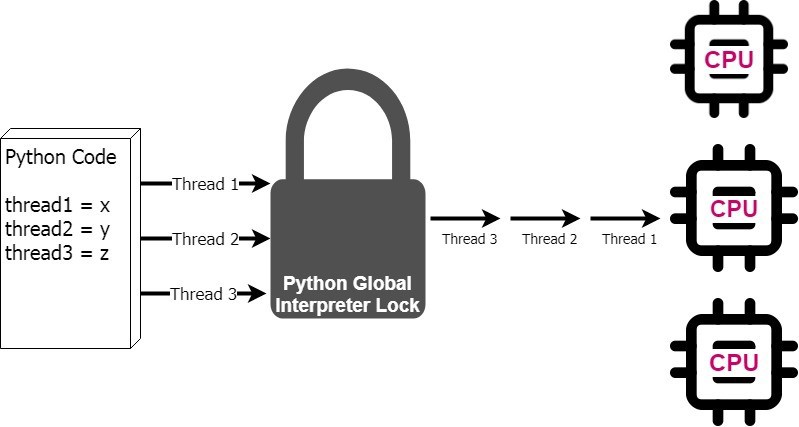

# Overview
Why we use multi-processes in python rather than multi-threads. 

### Multi-Threads
 

### Multi-Processes
 

# Reference
* https://medium.com/@urban_institute/using-multiprocessing-to-make-python-code-faster-23ea5ef996ba
* All images from https://medium.com/@urban_institute/using-multiprocessing-to-make-python-code-faster-23ea5ef996ba
